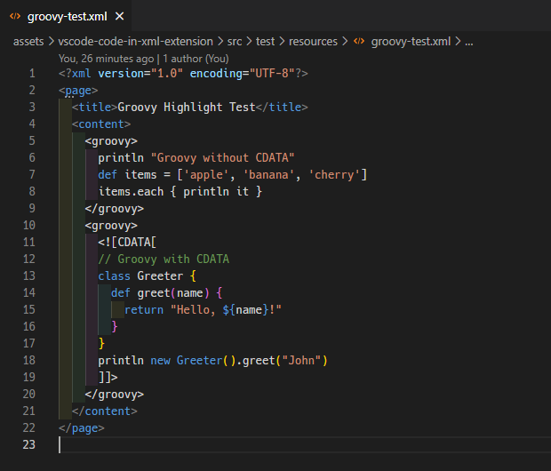

# Code embedded XML

Add syntax highlighting to embedded code blocks inside XML files — including `<groovy>`, `<javascript>`, and more.  
Clean and flexible syntax support for hybrid documents like configuration files, test scripts, and templating formats.



---

## ✨ Features

- ✅ Syntax highlighting for embedded `<groovy>` and `<javascript>` blocks inside XML  
- ✅ Supports both CDATA and inline content  
- ✅ The surrounding XML remains fully highlighted  
- ✅ Easy to extend to other languages (`<python>`, `<sql>`, etc.)

---

## 💡 Usage Example

### Groovy Block

```xml
<groovy>
println "Hello from Groovy!"
</groovy>
```

### JavaScript with CDATA

```xml
<javascript><![CDATA[
function sayHi(name) {
  return `Hi, ${name}!`;
}
console.log(sayHi("Smith"));
]]></javascript>
```

---

## 📂 File Types

This extension targets files with `.xml` extension by default.

---

## 🚀 Installation

Install via the [Visual Studio Code Marketplace](https://marketplace.visualstudio.com/)  
_or_  
Manually install from `.vsix`:

```sh
code --install-extension vscode-code-in-xml-0.0.1.vsix
```

---

## ⚙️ Requirements

- [Groovy Language extension](https://marketplace.visualstudio.com/items?itemName=Groovy-Guru.groovy) (for `source.groovy` highlight)  
- VS Code built-in JavaScript grammar is used automatically

---

## 🧪 Sample Files

Try these:

- `groovy-test.xml`: Contains `<groovy>` blocks with and without CDATA  
- `js-text.xml`: Contains `<javascript>` blocks to verify syntax highlight

---

## 📝 Known Issues

- Color themes must define styles for `source.groovy`, `source.js`, etc.  
- In very nested XML structures, some themes may ignore embedded scopes

---

## 📌 Release Notes

### 0.0.1

- Initial support for `<groovy>` and `<javascript>` blocks inside XML  
- CDATA and non-CDATA modes supported

---

## 🛠️ License

This project is licensed under the [MIT License](LICENSE).  
Copyright (c) 2025 Okkeng.

---

## 🙌 Credits

This extension reuses official TextMate grammars provided by:

- Visual Studio Code (for XML, JavaScript)  
- Groovy Extension (for `source.groovy`)
