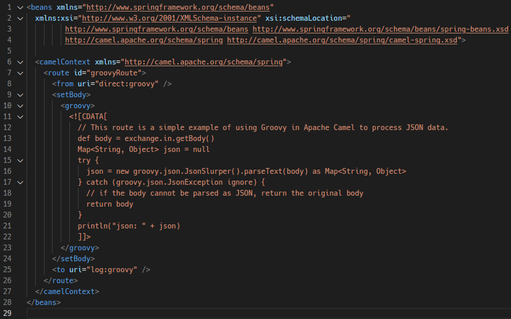
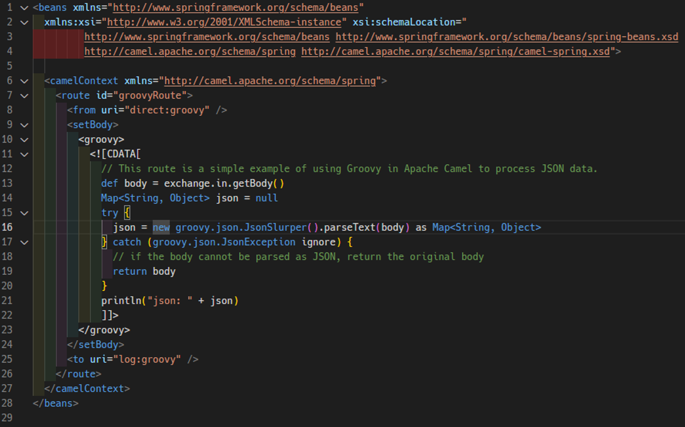

# Code in XML

Add syntax highlighting to embedded code blocks inside XML files. Support languages are following:  

- `<groovy>`
- `<javascript>`
- `<python>`

I made this extensions to help developers who work with XML DSL files that contain embedded code snippets.  
Here is the sample XML DSL file Images before and after applying this extension's syntax highlighting:  



I hope that colored lines help you to read codes easily and quickly:



---

## ✨ Features

- ✅ Syntax highlighting for embedded code blocks inside XML
- ✅ Supports both CDATA and inline content
- ✅ The surrounding XML remains fully highlighted

Future plans:  

- Enable the linter and formatter settings for each language
- Support another language if needed

---

## 💡 Usage Example

### Groovy Block

```xml
<groovy>
  println "Hello from Groovy!"
</groovy>
```

### JavaScript with CDATA

```xml
<javascript><![CDATA[
  function sayHi(name) {
    return `Hi, ${name}!`;
  }
  console.log(sayHi("Smith"));
]]></javascript>
```

---

## 📂 File Types

This extension targets files with `.xml` extension.  

---

## 🚀 Installation

Install via the [Visual Studio Code Marketplace](https://marketplace.visualstudio.com/)  
_or_  
Manually install from `.vsix`:  

```sh
code --install-extension vscode-code-in-xml-0.0.2.vsix
```

---

## ⚙️ Requirements

Install an XML extension for XML syntax highlighting, such as:  

- [XML Tools](https://marketplace.visualstudio.com/items?itemName=DotJoshJohnson.xml)
- [XML](https://marketplace.visualstudio.com/items?itemName=redhat.vscode-xml)

Additionally, add your preferred extensions for the languages you want to use, such as:  

- [Groovy Lint, Format and Fix](https://marketplace.visualstudio.com/items?itemName=NicolasVuillamy.vscode-groovy-lint) (for `source.groovy` highlight)  
- [Python extension](https://marketplace.visualstudio.com/items?itemName=ms-python.python) (for `source.python` highlight)
- VS Code built-in JavaScript grammar is used automatically (for `source.js` highlight)

Don't forget to add the necessary libraries to your Java project. See:  

- [Expression Languages](https://camel.apache.org/components/4.10.x/languages/index.html)
- [Java DSL](https://docs.spring.io/spring-integration/reference/dsl.html)

---

## 📝 Known Issues

- Color themes must define styles for `source.groovy`, `source.js`, etc.
- In very nested XML structures, some themes may ignore embedded scopes

---

## 📌 Release Notes

### v0.0.2

- Added support for `<python>` blocks inside XML.
- Changed the extension icon from auto-generated by Microsoft Copilot to one made by myself.
- Revised README by myself from auto-generated by Microsoft Copilot.

### v0.0.1

- Initial support for `<groovy>` and `<javascript>` blocks inside XML  
- CDATA and non-CDATA modes supported

---

## 🛠️ License

This project is licensed under the [MIT License](LICENSE).  
Copyright (c) 2025 Okkeng.  

---

## 🙌 Credits

This extension reuses official TextMate grammars provided by:  

- Visual Studio Code (for XML, JavaScript)
- Groovy Extension (for `source.groovy`)
- Python Extension (for `source.python`)
