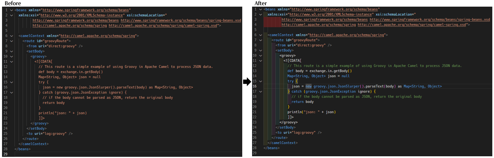
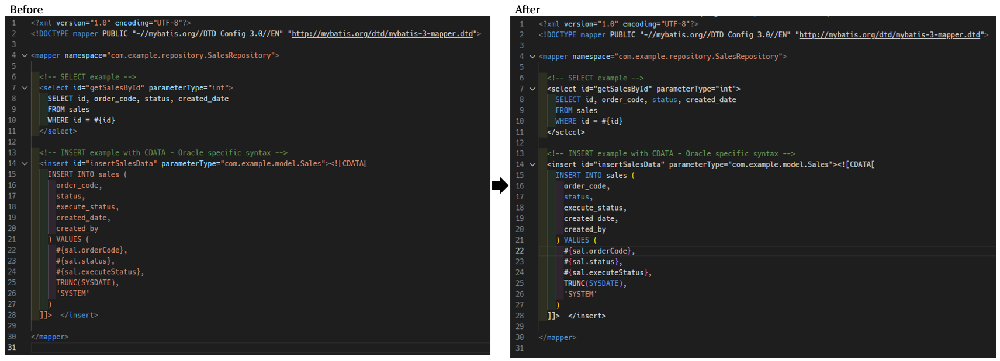

# Code in XML

Enables syntax highlighting for embedded code blocks inside XML files. Supported languages are:  

- `<groovy>`
- `<java>`
- `<javascript>`
- `<python>`
- `<ruby>`
- `<sql>` | MyBatis tags (`<select>` / `<insert>` / `<update>` / `<delete>`)
- `<bash>` | `<shell>` | `<sh>`

---

🌸 **Japanese note**  
XMLファイルに記述したプログラム言語に対し構文ハイライトを有効にします。言語用の拡張を追加すると、埋め込みコードに言語用の色分けが適用されます。  

---

I initially created this extension to help my team work with XML DSL files containing embedded Groovy code snippets for Apache Camel. Since it proved useful, I expanded it to support other languages like JS, SQL, and MyBatis mapper tags like `<select>`, `<insert>`, and so on.
For veteran developers, even just the syntax colors are a real help for reading.

*Example: Groovy in XML*


*Example: MyBatis mapper XML*


## ✨ Features

- ✅ Syntax highlighting for embedded code blocks inside XML
- ✅ Supports both CDATA and inline content
- ✅ The surrounding XML remains fully highlighted
- ✅ Native support for MyBatis mapper tags (`<select>`, `<insert>`, `<update>`, `<delete>`) — ideal for complex SQL with comments and special syntax
- ✅ Supports multiple SQL dialects (Oracle, MySQL, PostgreSQL)
- ✅ Targets `.xml` files

> **⚠️ Note:** This extension only provides grammar scopes — it does not highlight, format, or analyze code itself. Colors are applied by VS Code's theme engine using installed language extensions. If embedded code appears uncolored, install the corresponding language extension (see [Required Extensions](#-required-extensions)).

## 📋 Required Extensions

For full syntax highlighting, install language extensions based on the languages you use:

- **Java**: [Extension Pack for Java](https://marketplace.visualstudio.com/items?itemName=vscjava.vscode-java-pack) (Microsoft)
- **Python**: [Python](https://marketplace.visualstudio.com/items?itemName=ms-python.python) (Microsoft)
- **Groovy**: [Groovy Language Support](https://marketplace.visualstudio.com/items?itemName=marlon407.code-groovy) or similar
- **Ruby**: [Ruby](https://marketplace.visualstudio.com/items?itemName=shopify.ruby-lsp) (Shopify)
- **SQL**: [SQLTools](https://marketplace.visualstudio.com/items?itemName=mtxr.sqltools) (mtxr), [SQL Server](https://marketplace.visualstudio.com/items?itemName=ms-mssql.mssql) (Microsoft), or [PostgreSQL](https://marketplace.visualstudio.com/items?itemName=ms-ossdata.vscode-pgsql) (Microsoft)
- **JavaScript**: Built-in to VS Code

### Optional

For XML formatting and validation:

- [XML](https://marketplace.visualstudio.com/items?itemName=redhat.vscode-xml)
- [XML Tools](https://marketplace.visualstudio.com/items?itemName=DotJoshJohnson.xml)

## 🚀 Installation

Install via [Code in XML](https://marketplace.visualstudio.com/items?itemName=arukumo.code-in-xml) on the Visual Studio Code Marketplace  
*or*  
Manually install from `.vsix`:  

```sh
# Example: replace the version number as needed
code --install-extension code-in-xml-1.0.1.vsix
```

## 📝 Notes

- VS Code built-in JavaScript grammar is used automatically (for `source.js` highlight)
- In very nested XML structures, some themes may ignore embedded scopes
- In embedded code, words such as `name` and `status` in SQL may be highlighted as keywords by your installed language extension when they match reserved words

## 📌 Changelog

See [CHANGELOG.md](CHANGELOG.md) for detailed release notes and version history.

## ⚖️ License

This project is licensed under the [MIT License](LICENSE).  
Copyright (c) 2025-2026 arukumo.  

This extension does not bundle or redistribute third-party grammars.

---

## ☕ Support

If you find this extension helpful, a coffee would be greatly appreciated! ☕

<a href="https://www.buymeacoffee.com/arukumo"></a>
