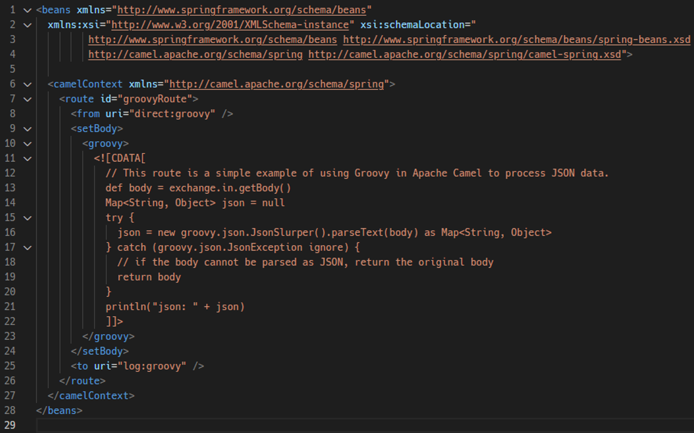
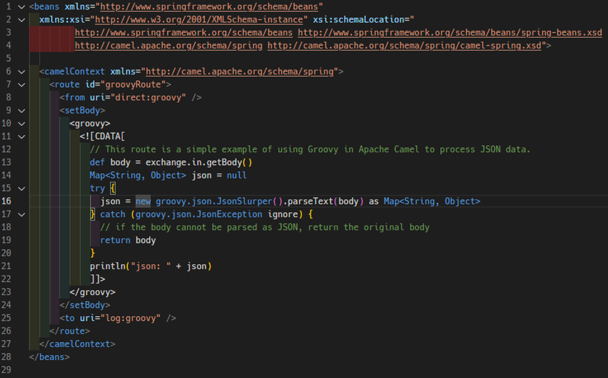

# Code in XML

Add syntax highlighting to embedded code blocks inside XML files, including MyBatis and other SQL-embedded XML formats. Supported languages are:  

- `<groovy>`
- `<java>`
- `<javascript>`
- `<python>`
- `<ruby>`
- `<sql>`
- `<bash>` / `<shell>` / `<sh>`

---

🇯🇵 **Japanese note**  
XMLファイルに記述した上記言語に対し各言語のハイライトをします。ハイライトは対象言語の拡張を追加してください。  

---

I made this extensions to help developers who work with XML DSL files that contain embedded code snippets. It also supports MyBatis XML mappers with native tags like `<select>`, `<insert>`, `<update>`, and `<delete>`.  
Here is the sample XML DSL file Images before and after applying this extension's syntax highlighting:  



I hope that colored lines help you to read codes easily and quickly:



---

## ✨ Features

- ✅ Syntax highlighting for embedded code blocks inside XML
- ✅ Supports both CDATA and inline content
- ✅ The surrounding XML remains fully highlighted
- ✅ Native support for MyBatis mapper tags (`<select>`, `<insert>`, `<update>`, `<delete>`)
- ✅ Supports multiple SQL dialects (Oracle, MySQL, PostgreSQL)

## 📋 Required Extensions

For full syntax highlighting, enable language support for the languages you use (for example):

- **Groovy**: Language support from VS Code Marketplace
- **Java**: Extension Pack for Java (Microsoft)
- **JavaScript**: Built-in to VS Code
- **Python**: Python (Microsoft)
- **Ruby**: Ruby (Shopify)
- **SQL**: SQL Tools (mtxr) or Better SQL Syntax Highlighting (Joe Previte)
- **Shell Script (bash/sh)**: ShellScript language support (VS Code shell grammar or marketplace extension)

Future plans:  

- Enable the linter and formatter settings for each language
- Support another language if needed

---

## 💡 Usage Examples

### Java Block

```xml
<java>
  public class Greeter {
    public String greet(String name) {
      return "Hello, " + name + "!";
    }
  }
</java>
```

### Python Block

```xml
<python>
  def greet(name):
      return f"Hello, {name}!"
  
  items = ['apple', 'banana', 'cherry']
  for item in items:
      print(item)
</python>
```

### JavaScript with CDATA

```xml
<javascript><![CDATA[
  function sayHi(name) {
    return `Hi, ${name}!`;
  }
  console.log(sayHi("Smith"));
]]></javascript>
```

### MyBatis SQL Example

```xml
<?xml version="1.0" encoding="UTF-8"?>
<!DOCTYPE mapper PUBLIC "-//mybatis.org//DTD Config 3.0//EN" 
  "http://mybatis.org/dtd/mybatis-3-mapper.dtd">

<mapper namespace="com.example.repository.UserRepository">
  <select id="getUserById" parameterType="int">
    SELECT id, name, email 
    FROM users 
    WHERE id = #{id}
  </select>

  <insert id="insertUser" parameterType="com.example.model.User"><![CDATA[
    INSERT INTO users (name, email, created_date)
    VALUES (#{name}, #{email}, SYSDATE)
  ]]></insert>

  <update id="updateUserEmail" parameterType="map"><![CDATA[
    UPDATE users 
    SET email = #{email},
        modified_date = NOW()
    WHERE id = #{id}
  ]]></update>

  <delete id="deleteUser" parameterType="int">
    DELETE FROM users WHERE id = #{id}
  </delete>
</mapper>
```

### Groovy Block

```xml
<groovy>
  println "Hello from Groovy!"
  def items = ['apple', 'banana', 'cherry']
  items.each { println it }
</groovy>
```

### Generic Language Attribute Format

```xml
<language language="sql">
  SELECT * FROM products WHERE status = 'active'
</language>
```

### Shell Script Block

```xml
<bash><![CDATA[
#!/usr/bin/env bash
set -euo pipefail

echo "start job"
for file in /data/in/*.csv; do
  echo "processing: $file"
done
]]></bash>
```

---

## 🎯 Use Cases

### Apache Camel XML DSL

```xml
<route>
  <from uri="direct:start"/>
  <process>
    <script language="python">
      message.body = message.body.upper()
    </script>
  </process>
  <to uri="direct:end"/>
</route>
```

### MyBatis Mapper with Complex SQL

```xml
<select id="findUsers" resultMap="userMap"><![CDATA[
  SELECT u.id, u.name, d.department_name
  FROM users u
  JOIN departments d ON u.dept_id = d.id
  WHERE 1=1
    <if test="name != null">
      AND u.name LIKE CONCAT('%', #{name}, '%')
    </if>
    <if test="status != null">
      AND u.status = #{status}
    </if>
  ORDER BY u.created_date DESC
]]></select>
```

---

## 📂 File Types

This extension targets files with `.xml` extension.  

---

## 🚀 Installation

Install via the [Visual Studio Code Marketplace](https://marketplace.visualstudio.com/)  
_or_  
Manually install from `.vsix`:  

```sh
code --install-extension vscode-code-in-xml-0.0.2.vsix
```

---

## ⚙️ Requirements

This extension requires VS Code to recognize language scopes. It works best when paired with language-specific extensions.

### XML Support (Optional)

- [XML Tools](https://marketplace.visualstudio.com/items?itemName=DotJoshJohnson.xml)
- [XML](https://marketplace.visualstudio.com/items?itemName=redhat.vscode-xml)

### Language Extensions (Recommended)

To enable syntax highlighting for embedded code, install the language extension for each language you use:

- **Java**: [Extension Pack for Java](https://marketplace.visualstudio.com/items?itemName=vscjava.vscode-java-pack) (Microsoft)
- **Python**: [Python](https://marketplace.visualstudio.com/items?itemName=ms-python.python) (Microsoft)
- **Groovy**: [Groovy Language Support](https://marketplace.visualstudio.com/items?itemName=marlon407.code-groovy) or similar
- **Ruby**: [Ruby](https://marketplace.visualstudio.com/items?itemName=shopify.ruby-lsp) (Shopify)
- **SQL**: [SQL Tools](https://marketplace.visualstudio.com/items?itemName=mtxr.sqltools) (mtxr) or [Better SQL Syntax Highlighting](https://marketplace.visualstudio.com/items?itemName=joe-previte.code-sql-syntax) (Joe Previte)
- **JavaScript**: Built-in to VS Code

---

## 📝 Notes

- This extension provides syntax highlighting for embedded code by delegating language recognition to VS Code's built-in language servers and marketplace extensions
- SQL support is particularly useful for **MyBatis** XML mappers, which often contain complex SQL with comments and special syntax
- The extension works with both inline code and CDATA sections
- Supported SQL dialects include Oracle, MySQL, and PostgreSQL (through the installed SQL extension)
- VS Code built-in JavaScript grammar is used automatically (for `source.js` highlight)

Don't forget to add the necessary libraries to your Java project. See:  

- [Expression Languages](https://camel.apache.org/components/4.10.x/languages/index.html)
- [Java DSL](https://docs.spring.io/spring-integration/reference/dsl.html)

---

## 📝 Known Issues

- Color themes must define styles for `source.groovy`, `source.js`, etc.
- In very nested XML structures, some themes may ignore embedded scopes

---

## 📌 Release Notes

### v1.0.0

- Added SQL highlighting support for XML-embedded SQL blocks.
- Added MyBatis mapper tag support: `<select>`, `<insert>`, `<update>`, and `<delete>`.
- Added SQL language attribute support: `<language language="sql">`.
- Added shell script tag support: `<bash>`, `<shell>`, and `<sh>`.
- Added shell language attribute support: `<language language="bash|shell|sh">`.
- Added test resources for Java, Python, MyBatis SQL, and shell script patterns.
- Updated README and extension metadata for official release.

### v0.0.2

- Added support for `<python>` blocks inside XML.
- Changed the extension icon from auto-generated by Microsoft Copilot to one made by myself.
- Revised README by myself from auto-generated by Microsoft Copilot.

### v0.0.1

- Initial support for `<groovy>` and `<javascript>` blocks inside XML  
- CDATA and non-CDATA modes supported

---

## 🛠️ License

This project is licensed under the [MIT License](LICENSE).  
Copyright (c) 2025-2026 okkeng.  

---

## 🙌 Credits

This extension delegates embedded-language highlighting to VS Code and installed language extensions.
It does not bundle or redistribute third-party grammars.

- Visual Studio Code built-in language support
- User-installed language extensions (for Groovy, Python, Ruby, SQL, and others)
